<h1 align="center">🖼️ Image Resizer using AWS Lambda, S3 & CloudFront</h1>

<p align="center">
  
  
  
  
</p>

---

## 📦 Project Overview

This project implements a **serverless image processing using AWS Lambda and S3** on AWS. When a user uploads an image to the source S3 bucket, an event notification automatically triggers a Lambda function that resizes the image and stores the processed version in a destination S3 bucket. The images are then efficiently delivere through **CloudFront CDN**. Infrastructure is managed using **Terraform** with HCL.

---

## ⚙️ Tools & Technologies

- **AWS** – S3, Lambda, CloudFront, CloudWatch, Shield, IAM
- **Terraform** – Infrastructure as Code (IaC)
- **Visual Studio Code (VSCode)** – Code Editor
- **Git** – Version Control System

---

## 🏗️ Architecture Overview

```mermaid
graph TD
    User[👤 User] -->|Upload Image| CloudFront
    CloudFront -->|Forwards to| S3[📤 S3 Source Bucket]
    S3 -->|Triggers Event| Lambda[🧠 AWS Lambda Function]
    Lambda -->|Resized Image| S3Resized[📥 S3 Destination Bucket]
    S3Resized -->|Served via| CloudFront
    CloudFront -->|Download Resized Image| User
```


## Installation

Dependency of python package for resize_image.py file is [pillow](https://pypi.org/project/pillow/) you need to install.

```bash
pip install pillow
```

## Infrastructure

<p align="center">
  
</p>

## 📁 Components

### S3 Buckets
- source-bucket: Accepts original image uploads.
- Destination-bucket: Stores resized images post Lambda processing.

### Lambda Function:
- Triggered by S3 upload events.
- Resizes images using a predefined configuration (e.g., max width/height).
- Uploads resized images to the destination bucket.

### CloudFront Distribution:
- Provides secure, low-latency access to both uploaded and resized images.
- Acts as the only public-facing endpoint.
- Uses Origin Access Control (OAC) to securely access S3.

## 🔐 Security Architecture
#### This project is designed with AWS Well-Architected Security Best Practices in mind:

✅ IAM
- IAM roles and policies strictly follow least privilege principles.
- Lambda only has access to required S3 buckets and CloudWatch logs.

🛡️ AWS Shield
- CloudFront is protected by AWS Shield Standard, which helps mitigate DDoS attacks.

📊 CloudWatch
- Lambda function logs and metrics are pushed to Amazon CloudWatch for observability.
- Monitors execution time, error rates, and invocations.

🔐 CloudFront (Security & Performance)
- Acts as a secure front-end, blocking direct S3 access.
- Enforces HTTPS-only connections with TLS.
- Optional signed URLs for restricted or time-limited access.

## ⬆️ Upload and Access Images

- Upload an image via the CloudFront upload endpoint.
- The image is resized via Lambda and stored in the destination bucket.
- Access the resized image via the CloudFront public URL.

## 🎯 Output
- ✅ Input: Original image uploaded via CloudFront to S3.
- ✅ Process: Lambda resizes the image on event trigger.
- ✅ Output: Resized image is accessible securely via CloudFront.

## 🧱 AWS Well-Architected Framework Alignment

### 1. Operational Excellence
- Terraform enables versioned and repeatable infrastructure.
- CloudWatch logging and metrics allow effective monitoring and alerting.

### 2. Security
- IAM, CloudFront, AWS Shield, and encryption enforce strict security.
- S3 buckets are private; CloudFront OAC controls access.
- Optional signed URLs can limit public access to resized images.

### 3. Reliability
- Serverless architecture automatically scales across multiple AZs.
- S3 provides high durability (11 nines).
- Lambda handles retries and failures.

### 4. Performance Efficiency
- CloudFront delivers images close to the user with caching.
- Lambda functions scale automatically and only run when triggered.

### 5. Cost Optimization
- No always-on infrastructure — pay only for what you use.
- Smaller resized images reduce S3 storage cost.
- CloudFront caching reduces Lambda invocation frequency.

## 🤝 Contributing

#### We welcome contributions! Follow these steps:

- Fork this repository.
- Create a new branch.
- Commit your changes.
- Open a pull request.

Please follow best practices for infrastructure and security.
#### For major changes, please open an issue first to discuss what you would like to change.
Please make sure to update tests as appropriate.

## 🔗 Useful Links

- AWS Lambda
- Amazon S3
- Amazon CloudFront
- Terraform AWS Provider

## License

This project is open-source and available under the [Bhagirath Jha](https://github.com/BhagirathJha)
