<h1 align="center">🖼️ Image Resizer using AWS Lambda, S3 & CloudFront</h1>

<p align="center">
  
  
  
  
</p>

---

## 📦 Project Overview

This project implements a **serverless image processing pipeline** on AWS. It resizes images automatically on upload and serves them efficiently through **CloudFront CDN**. Infrastructure is managed using **Terraform** with HCL syntax.

---

## ⚙️ Tools & Technologies

- **AWS** – S3, Lambda, CloudFront, CloudWatch, Shield, IAM
- **Terraform** – Infrastructure as Code (IaC)
- **Visual Studio Code (VSCode)** – Code Editor
- **Git** – Version Control System

---

## 🏗️ Architecture Overview

```mermaid
graph TD
    User[👤 User] -->|Upload Image| CloudFront
    CloudFront -->|Forwards to| S3[📤 S3 Source Bucket]
    S3 -->|Triggers Event| Lambda[🧠 AWS Lambda Function]
    Lambda -->|Resized Image| S3Resized[📥 S3 Destination Bucket]
    S3Resized -->|Served via| CloudFront
    CloudFront -->|Download Resized Image| User
```


## Installation

Dependency of python package for resize_image.py file is [pillow](https://pypi.org/project/pillow/) you need to install.

```bash
pip install pillow
```

## Infrastructure

<p align="center">
  
</p>

## Contributing

Pull requests are welcome. For major changes, please open an issue first
to discuss what you would like to change.

Please make sure to update tests as appropriate.

## License

[Bhagirath Jha](https://github.com/BhagirathJha)
